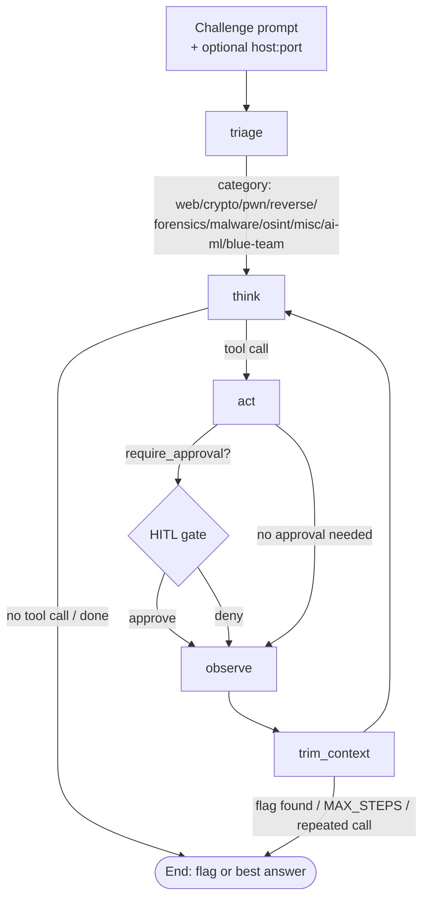

# Team Gamabunta — Autonomous CTF-Solving Agent

**Repository:** https://github.com/SalmonIsFish/CTF_Hackhaton

## 1. Mission

An autonomous LangGraph agent that solves live CTF challenges end-to-end — recon, exploit, flag
extraction — grounded in a team knowledge vault and 14 vetted technique packs. It's driven through
a live dashboard with human-in-the-loop approve/deny on every network call that touches a real
target, so a judge (or the team) can watch it reason and act on an unseen challenge in real time,
not a canned demo.

The core idea: `Agent = LLM + Tools + Loop + Context`, run as a ReAct cycle
(**Thought → Action → Observation → repeat**). Every component below maps back to one of those
four parts.

## 2. Agent Harness Architecture

**Control loop** (`agent/graph.py`): a bounded LangGraph state machine —
`triage → think → act → observe → trim_context`, capped at `MAX_STEPS = 15`. It exits early the
moment a tool result matches the flag pattern, or the model stops calling tools. `route_after_observe`
also ends the loop early if the last 3 tool calls were identical, since a live target timing out or
refusing is exactly the failure mode that invites a blind retry loop against real scored
infrastructure.

**Sub-agent (triage)**: a lightweight, separate model call classifies the incoming prompt into
`web / crypto / pwn / reverse / forensics / malware / osint / misc / ai-ml / blue-team / general`.
The `think` node's system prompt is then built per-category, nudging the model to ground its
reasoning in that category's skill pack before falling back to general knowledge — verified end to
end: a web-flavored prompt routes to `web`, an RSA prompt routes to `crypto`, each producing an
answer grounded in the right pack's actual content.

**State & context management**: `trim_context` runs once per loop iteration; once more than 16
think/act messages have accumulated, the oldest are dropped via LangGraph's delete-by-id message
reducer, always keeping the original challenge prompt untouched.

**Modular skills & tools**: every tool is a typed function with one clear docstring, covering four
tiers —

- *Local/offline*: `find_flag_pattern`, `identify_and_decode` (base64/hex/rot13), `search_vault`,
  `search_skills`, `web_search`, `rsa_tools`, `rsa_int_tools`, `math_tools`, `crack_hash`,
  `extract_metadata`, `read_local_file`.
- *Live network*: `fetch_url` (HTTP, with a cookie jar, header repair, and a `search_pattern`
  server-side-regex mode for oversized responses), `upload_file` (multipart), `tcp_open` /
  `tcp_send` / `tcp_close` (multi-turn interactive TCP sessions), `port_scan` (passive banner
  grab, no real nmap).
- *Binary analysis*: `radare2_analyze` — the one tool with a real subprocess/shell surface,
  bridged from Windows into a WSL toolchain, every mode a fixed argv template (never
  `shell=True`, never a command string built from model input).
- *Remote access*: `ssh_session` (`ssh_analyze_binary`, `ssh_run`) — narrowly scoped to
  SFTP-fetch-and-analyze and single-command-with-piped-stdin, not a general remote shell.

**Safety & observability**: `extract_allowed_hosts()` parses the host/IP out of the *original*
challenge prompt and `act()` refuses any live-network tool call whose target isn't in that set,
computed fresh every call so it can't go stale. Every live-target tool result is wrapped in
`<untrusted_data>` tags with an explicit system-prompt instruction not to treat that content as
directives — the first attacker-influenced (rather than team-authored) content this harness
handles. `require_approval` gates `fetch_url`/`tcp_open`/`port_scan`/SSH calls behind LangGraph's
`interrupt()` + a `MemorySaver` checkpointer, wired all the way through the CLI, the FastAPI
`/solve` → `pending_approval` → `/solve/resume` flow, and the dashboard's Approve/Deny buttons.

**Model/provider routing & fallback**: `agent/model_router.py`'s `_RotatingChatModel` pools
multiple Google API keys and rotates on a real `429`/quota error (cooldown, self-heals) or a real
`401`/dead-key error (effectively-permanent cooldown, falls through to a paid overflow key) —
never on an arbitrary exception. Provider is swappable (`anthropic` / `google` / `groq`) so
teammates without Claude access could build and test against a free-tier model.

**Memory & persistence**: short-term is the LangGraph message state trimmed each loop; long-term
is the Obsidian-format `vault/` — the team's own CTF notes, read by `search_vault` — checked
*before* the third-party `search_skills` packs, an explicit grounding-priority order added after a
run flaked once with an ambiguous tool choice between the two.

**Evaluation harness**: `evals/test_tools_smoke.py` (every tool, including the WSL-bridged
radare2 path against a real ELF), `evals/test_model_router_smoke.py` (rotation logic against
stubbed quota/dead-key errors), `evals/practice_targets.py` + `evals/practice_runs_network.py`
(offline CTF-shaped practice servers for full-loop regression since real instances expire), and 5
end-to-end test cases in `agent/graph.py`'s `__main__` block.

**Deploy/demo readiness**: `python -m demo.run_demo` / `run_demo_network` / `run_demo_hitl` are
one-command, fail-fast, offline, seeded demos exercising the static-file path, the live-network
tool path, and the HITL approval path respectively — each exits non-zero if no flag is found, so a
regression shows up as a failing command before demo day, not on stage.

## 3. Implementation Approach

1. Build the control loop and triage sub-agent first, verify with the cheapest possible tool
   (`echo`) before adding anything real.
2. Add offline/local tools (decoding, vault/skill search) and get the grounding-priority order
   right — this is where most of the "fabricated a flag instead of admitting failure" bugs showed
   up, and where most of the anti-fabrication system-prompt rules came from.
3. Only after the organizer confirmed some challenges ship as a bare IP did live-network tools get
   built — deliberately pure-Python, no subprocess/shell surface, so the safety story stays
   "host allowlist + timeout + loop-detection" instead of needing a sandbox.
4. Add the one deliberate subprocess exception (`radare2_analyze`) once Reverse Engineering
   challenges made "reason about disassembly from memory" clearly insufficient — scoped to
   read-only static analysis, fixed argv templates only.
5. Close the safety/observability gaps the organizer's own guidance called out explicitly
   (Isolate Execution → Docker, Enforce Permissions → HITL, Full Telemetry → LangSmith + JSONL
   run log) once the framework choice itself was locked.
6. Wire the dashboard to the *real* agent (it initially called a stub) and validate against actual
   external targets (TryHackMe, HackTheBox, picoCTF, and this event's own UCSI26 challenges), not
   just offline fixtures — this is where the majority of real, non-hypothetical bugs were found
   and fixed (see `evals/practice_runs.md` for the full narrative log).

## 4. Design Decisions

- **`gemini-3.5-flash-lite` as the default model**, not the more obvious `gemini-flash-latest` or
  `gemini-2.5-flash` — verified: 500 requests/day vs. 20/day, and it passed the hardest eval case
  (multi-step tool chaining) that a faster Groq model failed. Full comparison in
  `evals/practice_runs.md`.
- **No Docker sandbox, no Semgrep/Ghidra/Caido subprocess wrappers, no Triage/Exploit/Reporting
  multi-agent swarm** — considered and deliberately scoped out. The live-network tools are
  pure-Python with no shell surface, so a container's threat model doesn't add much; the
  allowlist+timeout+loop-detection model covers the actual new risk (hangs, runaway resource use,
  hitting the wrong host) at a fraction of the setup cost for a one-week build.
- **Grounding priority is explicit** (vault → skills → web search), not left to the model's
  judgment, because two tools legitimately overlap on some queries and an unordered choice wasn't
  deterministic in practice.
- **Anti-fabrication is enforced structurally, not just by prompting** — the single most common
  real bug across this project's build log was the model computing an answer in prose instead of
  through a tool, then reporting a plausible-but-wrong flag. The fix pattern that actually worked
  every time: build a real tool that performs the exact computation (RSA decrypt, modular
  exponentiation, hash cracking, cipher decode) instead of trusting the model to do arithmetic
  correctly in free text.
- **Human-in-the-loop on live-target actions, not full autonomy by default** — matches the
  organizer's own "Enforce Permissions" guidance, and reflects a real judgment call: an agent that
  can be paused before it hits scored infrastructure is more trustworthy than one that can't,
  even at some cost to hands-off demo appeal.

## 5. Results

29 real flags captured across picoCTF, HackTheBox, and this event's own UCSI26 challenges — see
[`evals/solved_challenges.md`](./evals/solved_challenges.md) for the full index and
[`evals/practice_runs.md`](./evals/practice_runs.md) for narrative write-ups including every bug
found and fixed along the way. Four flags came from the live competition itself:

| Challenge | Category | Flag |
|---|---|---|
| Saturn Exchange | web — business-logic race condition (TOCTOU) | `UCSI26{REDACTED}` |
| StaffDesk | web — GraphQL IDOR → admin takeover | `UCSI26{REDACTED}` |
| Sandworm VM | pwn — custom VM, unchecked-offset OOB read/write | `UCSI26{REDACTED}` |
| Pony Express Dispatch | web — SSTI, CVE-2026-33937 Handlebars AST injection RCE | `UCSI26{REDACTED}` |

Autonomy is reported honestly per challenge rather than rounded up: many picoCTF/HTB flags were
captured by the agent loop end-to-end with zero human intervention; the four competition flags
above were solved directly against live scored infrastructure (by a human or by Claude Code), with
the real capability gaps this exposed — no concurrent-request tool, no GraphQL-introspection
nudge, no custom-ISA reversing workflow, no nested-JSON-object body support — called out as open
items rather than glossed over.

## 6. Team

| Role | Owns |
|---|---|
| Agent core | LangGraph state graph, harness, tool development, Obsidian vault wiring, final integration |
| Frontend | Next.js + Vercel AI SDK dashboard, HITL approve/deny UI |
| Prompts & evals | Sub-agent design, eval harness, test cases |
| Vault & pitch | Obsidian vault content, pitch narrative, demo script, judge Q&A prep |

For the full technical build history — every bug found, every design decision's rationale, and
every session's changes — see [`CLAUDE.md`](./CLAUDE.md).
